# Field-trial photographs

Selected original embedded images from `DGFC Trials Results -v1.docx`, supplied by Mark Butterworth. Captions follow the report context; dates are documentary associations, not verified camera timestamps. Images are copied byte-for-byte, without enhancement, cropping or generated content. Photo selection illustrates equipment, canopy and access; numerical reception analysis uses the complete eligible inventory described in the protocol.

[Photo inventory and hashes](photo_inventory.csv) · [Field documentation](../README.md)

## P01 — Portable trial equipment

Deployment-equipment photograph: computer, radio/battery case and antenna materials.

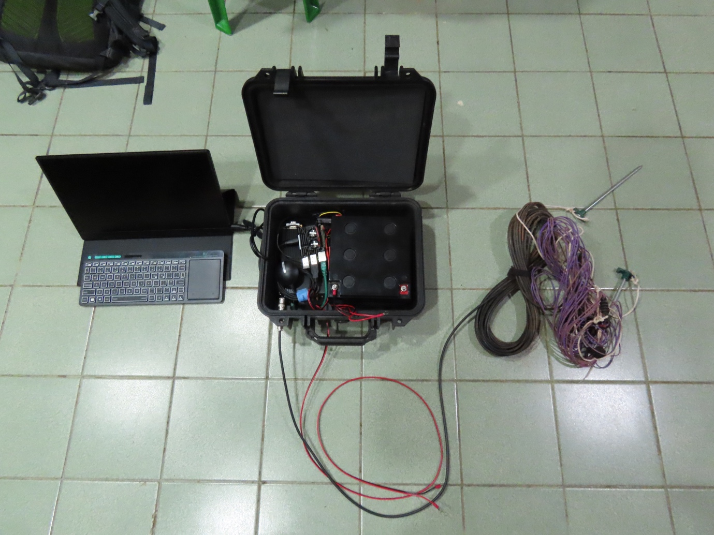

## P02 — Blue Trail installation

Remote equipment at the base of a tree, associated with the report’s 17 April 5.357 MHz deployment.

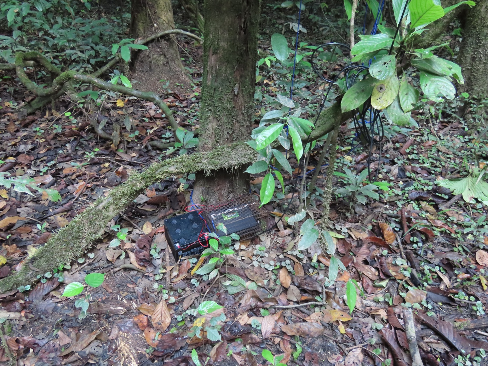

## P03 — Base-station canopy

Vegetation above the base-station antenna area.

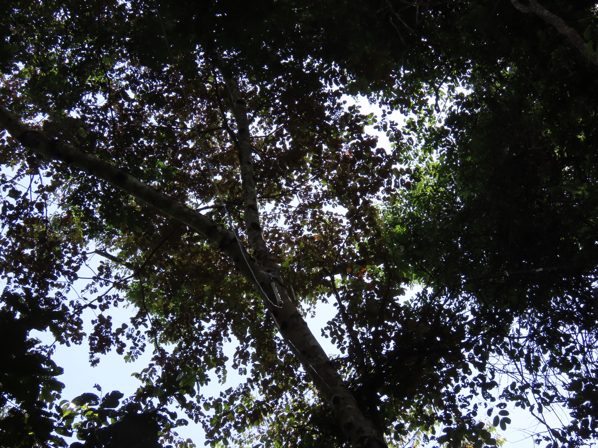

## P04 — Base-station antenna setting

Second view of canopy and antenna installation context.

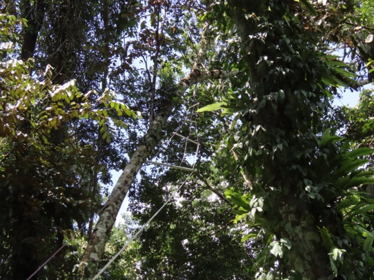

## P05 — Ridge 1 equipment

Equipment beneath canopy, associated with the Ridge 1 section of the 18 April report.

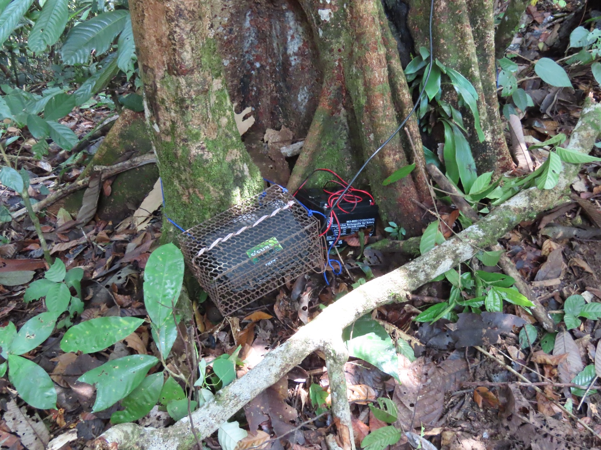

## P06 — Ridge 2 setting

Installation setting paired with the 18 April Ridge 2 7.078 MHz entry.

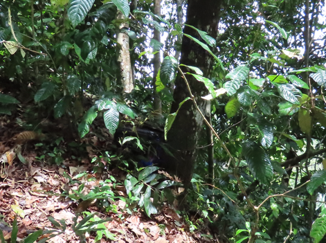

## P07 — Ridge 2 canopy

Annotated canopy photograph from the report. Its original length annotation is documentary, not a new calibrated measurement.

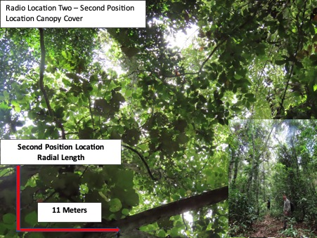

## P08 — River access

River-bank vegetation shown in the 20 April battery-change section.

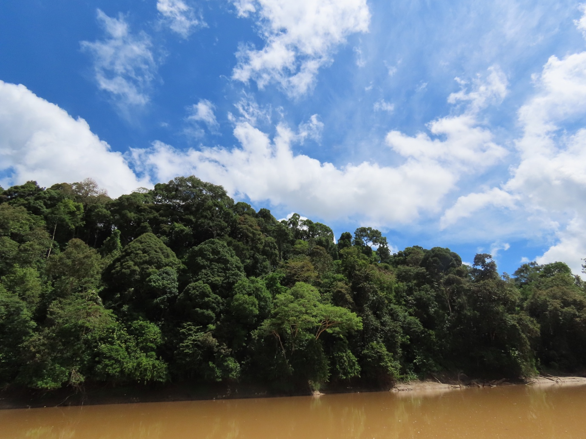

## P09 — Base antenna retuning setting

Canopy/antenna setting associated with the 22 April base-antenna modification.

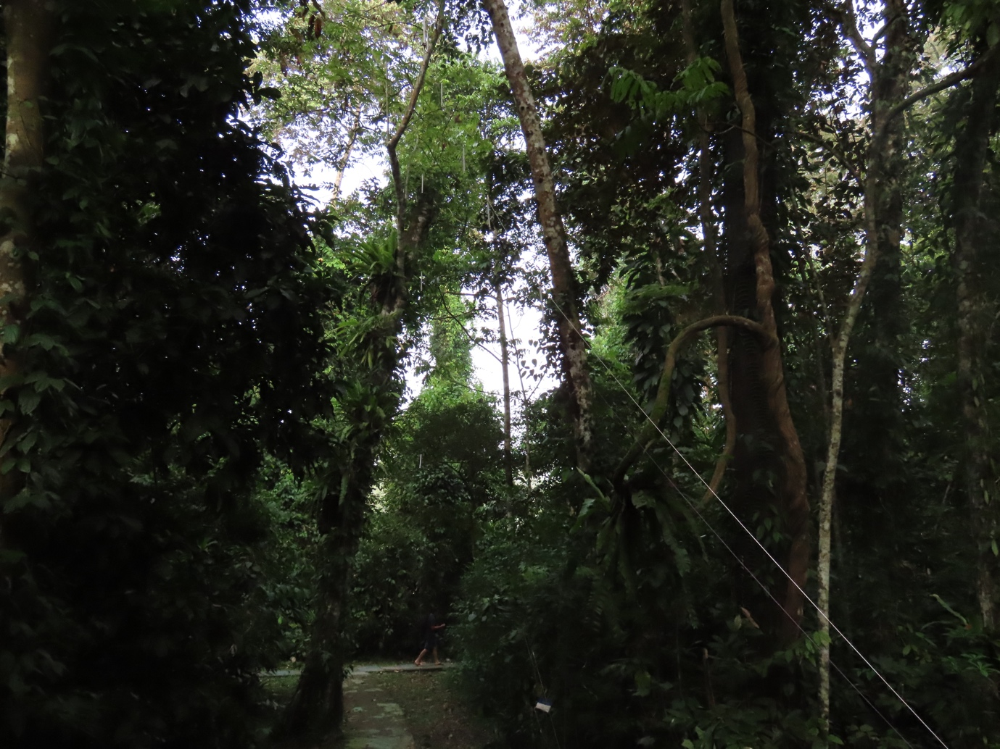

## P10 — Field antenna measurement

Laptop and antenna-measurement equipment during the 23 April ridge retuning work.

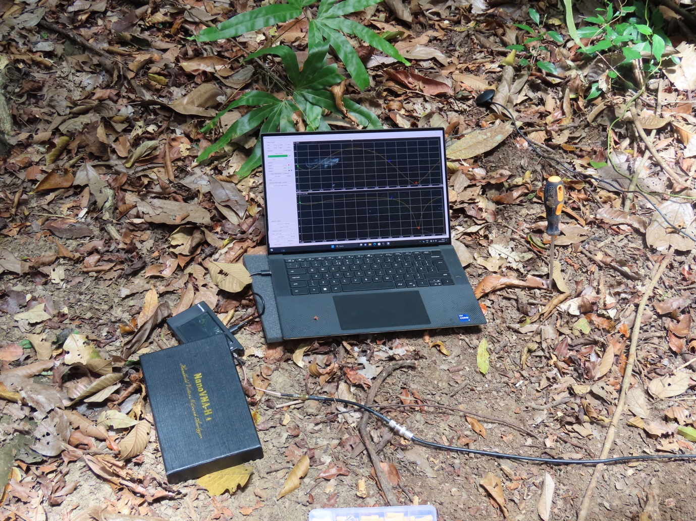

## P11 — Ridge equipment during servicing

Field equipment photograph in the 24 April battery-change section.

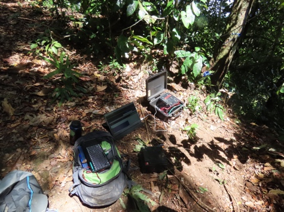

## P12 — Additional canopy view

Canopy photograph in the report’s closing third-location material; no precise capture date assigned.

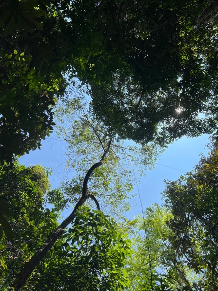
